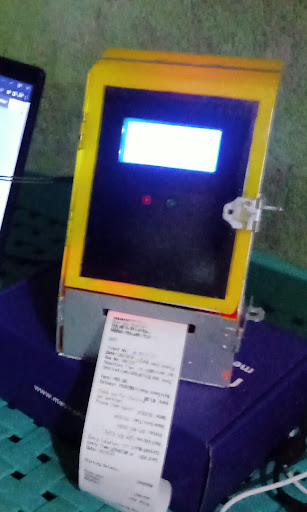

# TripsPH: Transportation RFID Integrated System using PHP

# What is TripsPH?

The TripsPH (Transportation RFID Integrated System using PHP) is our
Thesis entitled the "Bus Ticketing System with RFID and E-payment Integration
for bus fare collection" introduces a multifaceted approach to optimize
bus ticketing systems. Its core technology is powered by the ESP-8266
microcontroller that utilizes Radio Frequency Identification (RFID) for
enhanced data retrieval, fare administration, and passenger convenience.
Specialized Arduino code ensures accurate recording of card entry and
exit, providing precise data retrieval and passenger tracking during bus
journeys. Haversine formula was implemented specifically to manage fare
collection and calculate distances travelled. The system also features
a thermal printer to generate journey tickets and receipts, displaying
fare amount, journey details, and other relevant information such as
distance travel and the place of dispatch and arrival. Real-time
communication is facilitated through a status indicator, utilizing a
Liquid Crystal Display (LCD) and Light Emitting Diode (LED) for success
and failed tapping, resulting in efficient communication and transit
operations. The study also integrates a comprehensive Administrative
System, enabling various user roles to manage fare matrix, rules, profiles,
and trip records, thereby ensuring efficient management and control of
associated data. With automation processes handling passenger origin
and destination details, verifying accuracy, and calculating distances
travelled, fare calculation and collection are further simplified.
The Stripe integration as a digital payment method allows cashless
transactions for RFID cards which provides real-time updates on payment
status but the reloading system was not limited to this type of payment;
it was also available in Gcash and Paymaya. This system effectively
collects, stores, and manages reload transaction records, ensuring
transparency and accountability throughout its operation.

<h1 align="center">
    
  TripsPH: Transportation RFID Integrated System using PHP
</h1>

<b> The TripsPH is a bus ticketing system that uses RFID, ESP-8266 microcontroller, thermal printer, LCD, LED, Haversine formula, web development frameworks and Stripe integration to optimize fare collection, data management, and passenger convenience.</b>

## :bulb: Features

:house: TripsPH Admin Dashboard

1. Landing Page
2. Loading Page using Different Payment Methods
3. View Past Transactions
4. TripsPH Home Dashboard with Data Analytics of Transactions
5. All TripsPH Card Transactions Page with Ticket No., RFID ,Type ,Amount, Entry Time, Entry Location, Exit Time, Exit Location, Fare ,Km. Travelled, Current Balance, Total Balance ,Valid Until, Date Created
6. TripsPH Card Reloading Transactions Page with Ticket No., RFID, Type, Email, Payment Method, Payment Status, Payment Intent, Amount, Current Balance, Total Balance, Card Expiration, Date Created
7. TripsPH Card Travel Transactions Page with Ticket No., RFID ,Type, Entry Time, Entry Location, Exit Time, Exit Location, Fare ,Km. Travelled, Current Balance, Total Balance ,Valid Until, Date Created
8. Personnel Management Page with Name, Position, Email, Contact No., Address, Created At, Updated At, and Action Buttons (View, Edit, Delete)
9. Bus Managemennt Page with Bus No.,Type, Purchase Date, Operator, Driver, Route, Status, Created At, Updated and Action Buttons (View, Edit, Delete)
10. Export Records into Excel, Add Records, Card Validity, Auto-generate ticket number, and Account Roles System

:house: TripsPH Admin Dashboard

- if fare > total_balance failed
- if total_balance < 200 failed no computation
- if failed yung reloading sa reload table no computation
- if from reload, "reloading" yung type
- if from passenger table without fare value "Departed" yung type
- if fromif from passenger table with fare value "Arrived" yung type
- ticket_no. resets every-day composed of number and row and date ex. 1-270723 (1 is row no. 27 day, 07 month, 23 )

:mouse: TripsPH Fare Box

1. Tap in and Tap out of RFID TripsPH Cards to record the cards details including the coordinates and calculate the Km. Travelled for the fare
2. Print Receipt from the point of Entry and Exit
3. Show the TripsPH Card Balance, Status and Location to the LCD

## :warning: How to Deploy:

###### Requirements :

- Download and Install any local web server such as XAMPP/WAMP.
- Download the provided source code zip file.
- The TripsPH Dashboard and TripsPH Fare Box are connected with a same local network.
- Create an account in Stripe https://stripe.com/ to get your own Stripe secret API Key
- Donwload Arduino IDE and install all the required Libraries

###### Installation/Setup of TripsPH Dashboard :

- Open your XAMPP/WAMP's Control Panel and start the Apache and MySQL.
- If you are using XAMPP, copy the extracted source code folder and paste it into the XAMPP's "htdocs" directory. And If you are using WAMP, paste it into the "www" directory.
- Browse the PHPMyAdmin in a browser. i.e. http://localhost/phpmyadmin
- Create a new database naming tripsph.
- Import the provided SQL file. The file is known as tripsph.sql located inside the database folder.
- Browse the TripsPH_Dashboard in a browser. i.e. http://localhost/TripsPH_Dashboard/
- To get your API keys Login to your stripe dashboard, go to the right top corner under the profile dropdown you will see the developer link. Find the secret key and copy keep it somewhere because your are going to use it.
- Browse C:\xampp\htdocs\TripsPH_Dashboard\constants.php and C:\xampp\htdocs\TripsPH_Dashboard\StripeHelper.php To change your own Stripe Secret API Key
- To access the project in different devices and the payment page, change the http://192.xxx.xxx.xxx/TripsPH_Dashboard/ and 192.xxx.xxx. from C:\xampp\htdocs\TripsPH_Dashboard\checkout.php with your device(server) IP address

###### Installation/Setup of TripsPH Fare Box :

- Download all the required libraries inside Arduino IDE
- Open the
- Put Your Server or Local Network WIFI SSID and Password to TripsPH_Fare_Box.ino
- Compile then Run

###### Account Roles :

Username: anya@anya
Password: anya123
Role: Admin

Username: loid@loid
Password: loid123
Role: Editor

Username: yor@yor
Password: yor123
Role: User only

admin = view, edit, delete, active, add, profile
editor = view, edit, profile, add deactivate
user only = view, profile, add deactivate

## 📎 📱 Screenshots

| TripsPH Landing Page | TripsPH Admin Dashboard |
| :------------------: | :---------------------: |
|             |                |

The TripsPH Web Appp composed of comprehensive Administrative System that enables various user roles to manage fare matrix, rules, profiles, and trip records. This system effectively collects, stores, and manages reload transaction records, ensuring transparency and accountability throughout its operation. The Stripe integration as a digital payment method allows cashless transactions for RFID cards which provides real-time updates on payment status but the reloading system was not limited to this type of payment; it was also available in Gcash and Paymaya. With automation processes handling passenger origin and destination details, verifying accuracy, and calculating distances travelled, fare calculation and collection are further simplified. This web app is an essential part of the "Bus Ticketing System with RFID and E-payment Integration for bus fare collection" that introduces a multifaceted approach to optimize bus ticketing systems.

| TripsPH Fare Box | TripsPH Card |
| :--------------: | :----------: |
|         |     |

<h1 align="center">
   
</h1>

The RFID reader is a device that can read and write data from RFID cards, which are used by passengers to pay for their bus fares. The RFID reader is connected to the ESP-8266 microcontroller, which is the core of the system. The ESP-8266 microcontroller is a low-cost Wi-Fi chip that can communicate with the internet and other devices. It runs the Arduino code that implements the Haversine formula to calculate the distance travelled by the passengers and the fare amount. The ESP-8266 microcontroller also sends the data to the thermal printer, which prints out the tickets and receipts for the passengers. The thermal printer shows the fare amount, journey details, and other relevant information such as distance travel and the place of dispatch and arrival.The ESP-8266 microcontroller also controls the status indicator, which consists of an LCD display and an LED. The status indicator shows the success or failure of tapping the RFID card, as well as the balance and other messages. The LCD display is a screen that can show text and graphics, while the LED is a light that can change color depending on the status.The hardware components are powered by a battery or an external power source, depending on the availability and preference of the bus operator. The hardware components are also enclosed in a durable casing to protect them from damage and theft.

# Acknowledgements

We would like to thank our professor, Mr. Utulo our Research Adviser, for guiding us throughout the development of this project

# Prepared By:

    Flores, Richard John
    Nunez, John Andrei
    Montalvo, Regienald
    Mose, Thea Marie
